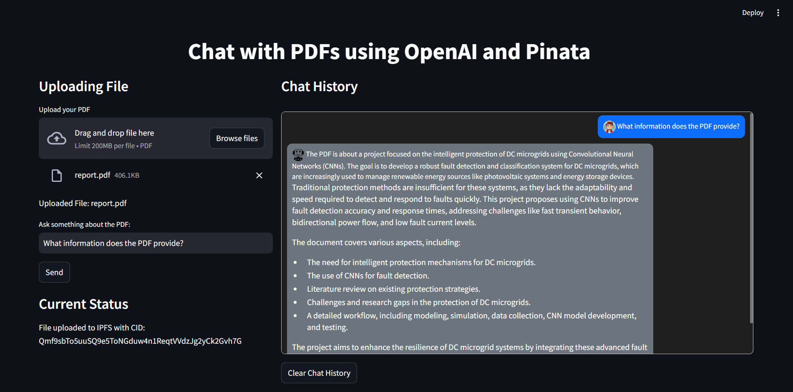

# Chat with PDFs using OpenAI and Pinata

Welcome to the **Chat with PDFs** app! This Streamlit-based application allows users to upload PDF files, extract their content, and ask questions about the text. The app integrates with OpenAI's language model to answer user queries and stores PDFs on IPFS (InterPlanetary File System) via Pinata for decentralized storage. Additionally, the app provides a chat history, feedback mechanism, and error handling for seamless interaction.

## Table of Contents
- [Overview](#overview)
- [Features](#features)
- [Tech Stack](#tech-stack)
- [Prerequisites](#prerequisites)
- [Installation](#installation)
- [Environment Variables](#environment-variables)
- [Usage](#usage)
- [Logging](#logging)
- [Directory Structure](#directory-structure)

<a name="overview"></a>
## Overview

This project is designed to enable users to:
- Upload a PDF document.
- Extract the text from the PDF.
- Ask questions about the content using OpenAI’s language model.
- Store the uploaded PDF securely on IPFS via Pinata and return a CID (Content Identifier) for reference.
- View chat history and provide feedback on the AI responses.

The app features error handling, retry mechanisms for network operations, and user feedback storage. It is built for scalability and ease of use.

Here’s an example of how the Streamlit interface looks:



<a name="features"></a>
## Features

- **PDF Upload**: Users can upload PDF files up to 10MB in size.
- **Text Extraction**: Extract text from PDFs and store it for querying.
- **Chat with AI**: Ask questions about the PDF's content, powered by OpenAI’s language model.
- **IPFS Storage**: Upload PDFs to IPFS using Pinata and retrieve a CID for decentralized storage.
- **Chat History**: Maintain chat history and display it to users in an intuitive format.
- **Feedback**: Collect user feedback on the quality of AI responses and store it for future analysis.
- **Logging**: Centralized logging for actions and errors to monitor and debug the application.

<a name="tech-stack"></a>
## Tech Stack

- **Frontend**: [Streamlit](https://streamlit.io/) for the user interface.
- **Backend**: [OpenAI API](https://beta.openai.com/) for processing questions and generating responses.
- **Storage**: [Pinata](https://pinata.cloud/) for storing PDFs on IPFS.
- **PDF Processing**: [PyPDF2](https://pypi.org/project/PyPDF2/) for extracting text from PDFs.
- **Environment Management**: [dotenv](https://pypi.org/project/python-dotenv/) for managing environment variables.
- **Logging**: Python’s built-in `logging` module for application-level logging.

<a name="prerequisites"></a>
## Prerequisites

Before running this application, ensure you have the following installed:
- Python 3.8+
- [OpenAI API Key](https://openai.com/api/)
- [Pinata API Key and Secret](https://pinata.cloud/)

<a name="installation"></a>
## Installation

To get started, follow these steps:

1. **Clone the repository:**

   ```bash
   git clone https://github.com/your-username/chat-with-pdf.git
   cd chat-with-pdf

2. **Set up a virtual environment (recommended):**

   ```bash
   python3 -m venv venv
   source venv/bin/activate   # On Windows, use `venv\Scripts\activate`

3. **Install the dependencies:**

   ```bash
   pip install -r requirements.txt

4. **Set up the environment variables:**

   - Add the required API keys and environment settings in `.env` file.

<a name="environment-variables"></a>
## Environment Variables

Create a `.env` file with the following keys:

    OPENAI_API_KEY=your_openai_api_key
    PINATA_API_KEY=your_pinata_api_key
    PINATA_API_SECRET=your_pinata_api_secret

<a name="usage"></a>
## Usage

Once the environment is set up and dependencies are installed, run the application:

    streamlit run app.py

## Interacting with the App

- **Upload a PDF**: Click on "Upload your PDF" and select a file.
- **Ask a Question**: After the text is extracted from the PDF, type a question related to the content in the text input box.
- **View Responses**: The AI’s response will appear in the chat interface.
- **Submit Feedback**: Provide feedback on the quality of responses, which will be stored for review.

## Example Interaction

1. **Upload** a document titled `report.pdf`.
2. **Ask**: “What are the key findings from this report?”
3. **View** the response in the chat history and submit feedback if needed.

<a name="logging"></a>
## Logging

- All interactions and errors are logged in the `data/logs/app.log` file. This helps with monitoring the system and troubleshooting issues.

<a name="directory-structure"></a>
## Directory Structure

The project follows this folder structure:

```
chat-with-pdf/
│
├── data/
│   ├── files/               # Uploaded PDF files
│   ├── logs/                # Log files
│   │   └── app.log          # Application logs
│   ├── chat_history.json    # Stores chat history
│   └── feedback.txt         # Stores user feedback
│
├── .env                     # Environment variables
├── app.py                   # Main Streamlit app script
├── openai_file.py           # Handles OpenAI API calls
├── pinata.py                # Handles PDF uploads to Pinata
├── utils.py                 # Utility functions
├── requirements.txt         # Python dependencies
└── README.md                # Project documentation
```
